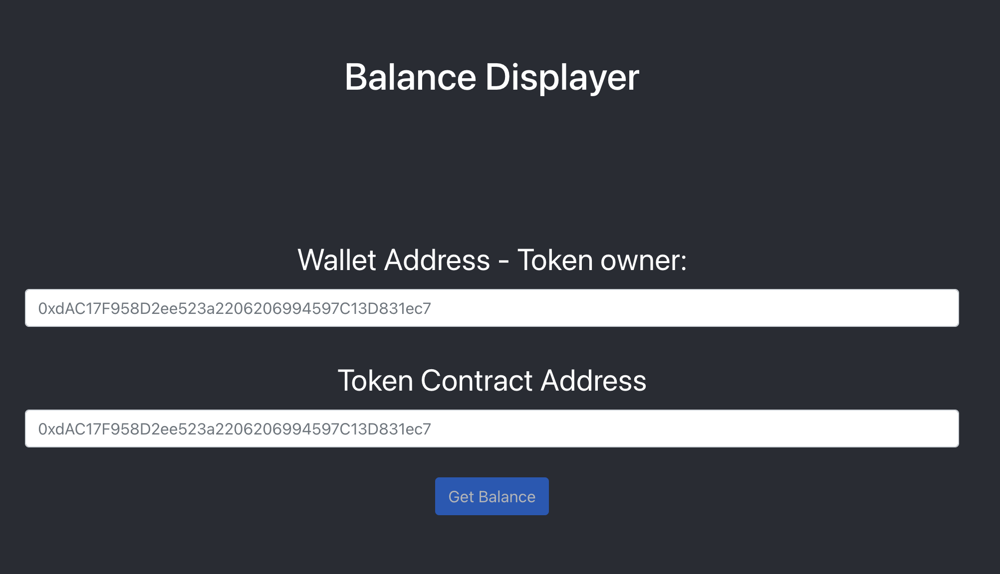
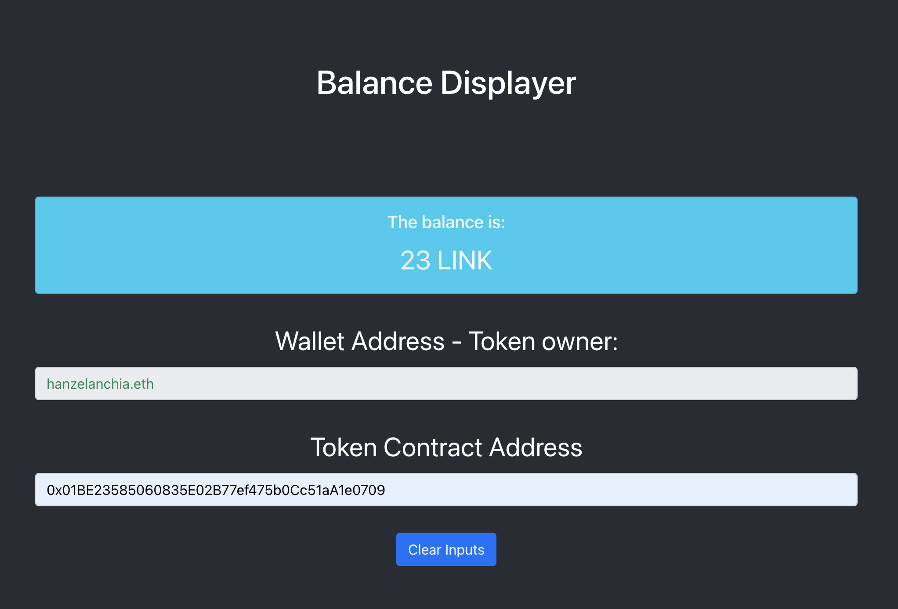

# Balance Displayer

This project can be used to get the balance that a given Account Address has in a given Token Smart Contract. This is a very common task in the blockchain ecosystem. Usually, wallets like Metamask give you only your account information. In this case the user does not need to be the owner of the tokens to know the balance.

Use case examples:
- It could be used to know if an account has enough balance to perfom some blockchain operation. 
- I can be used to check if a recipient's address received the tokens that were sent.

## How to setup the project

1. Clone this repository.
2. Run `npm install` inside the root folder of the project.
3. Go to the [.env](https://github.com/hanzel98/balance-displayer/blob/master/.env) and change the REACT_APP_NETWORK variable value to the network you want to use. Posible opcionts are: `mainnet, rinkeby, ropsten, kovan` the default is set to `mainnet`. It is worth noting that it is currently using personal Infura websocket connections. This was done intentionally to make the testing easier for the test reviewer.
4. Run `npm start` to start the server. The application interface will open in: http://localhost:3000 . If you have that port running something else, please stop that process and try again.

## How to use it

- Wallet Address: Insert here the address of the owner of the tokens.
- Token Contract Address: This is the contract were the tokens can be found. It must be an ERC20 smart contract implementation. It varies depending on the network in use. 
- There is a validation for real Ethereum addresses in both inputs. If a wrong value is 
provided the UI will show an alert indicating it.
- After inserting both valid ethereum addresses the `Get Balance` button will be available. Click on the button to request the token balance. This process does a call to the blockchain, so, it takes some seconds to retrieve the data.
- The balance and the token symbol will be displayed above the form.
- The addresses in the form cannot be changed while it is showing the balance. This is done to avoid confusion about what addresses were used.
- It is possible to repeat the whole process by clicking the button `Clear Inputs`.

A video demonstration can be found here: [Video](https://youtu.be/gl_X7Weuyko) (Only people with this link can see it)

### Important considerations
Ethereum Name Service compatibility was implemented for both inputs. It is possible to insert a real ENS value and the application will convert it to the correspondig ethereum address. The input validation allows real ENS values, so it will not show an error.

### This how the application looks like before inserting the values:

### This how the application looks while showing the balance:

## Missing features
- The exercise requires to show the ENS name if an Address has one. And the asociated Address of an ENS name. Instead of doing that, I'm just converting the ENS name to a Address internally. But it is still possible to use an ENS name or an Address in any field.